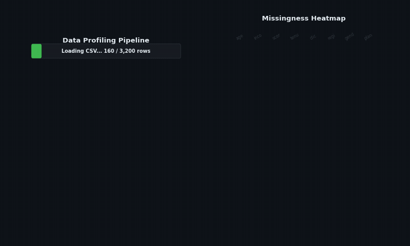
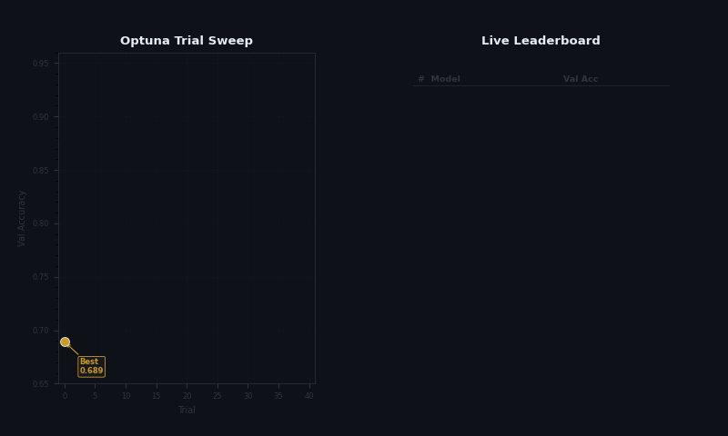
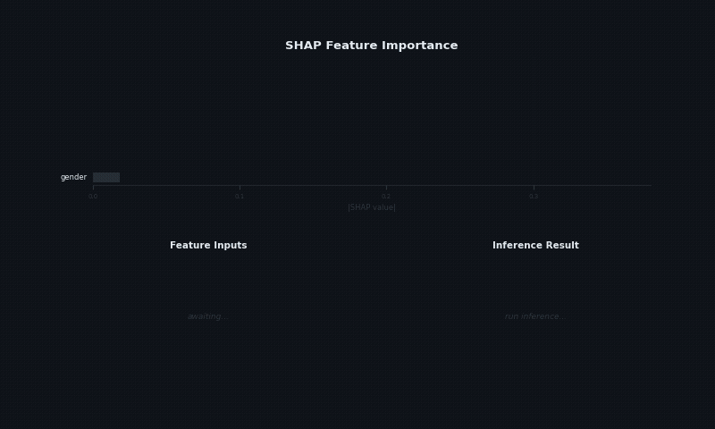

# AxiomCloud

A production-grade, full-stack AutoML platform for dataset diagnostics, controlled model training, explainability, and live inference. AxiomCloud mirrors a practical Vertex AI or Kaggle-style workflow with deeper dataset quality controls and flexible GPU execution modes.

---

## Features

### Dataset Upload and Profiling

Upload CSV or Excel files (or use built-in example datasets) and receive an instant quality report covering missingness rates, duplicate rows, outlier flags, leakage risk per feature, and a composite quality score with actionable recommendations.



### AutoML Training and Leaderboard

Run Optuna-powered hyperparameter sweeps across up to five models in a single experiment. The platform auto-detects task type (classification or regression), applies dataset-aware starting hyperparameters, and populates a live leaderboard ranked by validation accuracy.



### SHAP Explainability and Inference Sandbox

Inspect trained models with SHAP and LIME feature importance reports. The inference sandbox generates a pre-filled feature template sampled from the training data profile, accepts manual overrides, and returns class probabilities alongside a prediction verdict in real time.



---

## Architecture

```
┌────────────────────────────────────────────────────────────┐
│                        Browser Client                      │
│                    Next.js 14 / React                      │
│       (Dashboard, Training, Leaderboard, Inference UI)     │
└───────────────────────────┬────────────────────────────────┘
                            │  HTTPS / REST / Firebase Auth
┌───────────────────────────▼────────────────────────────────┐
│                      FastAPI Backend                       │
│   /datasets   /train   /models   /explain   /predict       │
│   Optuna   scikit-learn   SHAP   LIME   joblib             │
└────────┬──────────────────────────────────┬────────────────┘
         │                                  │
┌────────▼──────────┐             ┌─────────▼──────────────┐
│   PostgreSQL DB   │             │   Model Artifact Store  │
│  (experiment runs,│             │   (.joblib files,       │
│   metrics, logs)  │             │    SHAP outputs)        │
└───────────────────┘             └────────────────────────┘
         │
┌────────▼────────────────────────────────────────────────────┐
│                        Docker Compose                       │
│       backend   frontend   db   (optional local-agent)      │
└─────────────────────────────────────────────────────────────┘
```

| Layer | Technology |
|---|---|
| Frontend | Next.js 14, React, Tailwind CSS |
| Backend API | FastAPI (Python 3.11) |
| AutoML engine | scikit-learn, XGBoost, LightGBM, Optuna |
| Explainability | SHAP, LIME |
| Database | PostgreSQL 15 |
| Auth | Firebase Authentication |
| Container | Docker, Docker Compose |

---

## Quickstart

**Prerequisites:** Docker and Docker Compose installed.

```bash
git clone https://github.com/Keshavj-13/axiomcloud.git
cd axiomcloud

# Copy and configure environment variables
cp .env.example .env
# Edit .env with your Firebase credentials and desired settings

# Start all services
docker-compose up --build
```

The frontend will be available at `http://localhost:3000` and the API at `http://localhost:8000`.

To stop all services:

```bash
docker-compose down
```

---

## Execution Modes

AxiomCloud supports two distinct training execution modes selectable from the experiment configuration UI.

### Remote GPU Mode

Training jobs are queued and executed on the server. The backend handles the full lifecycle: dataset loading, cross-validation, Optuna sweeps, artifact saving, and metric reporting. No local setup is required beyond a browser. This mode is suitable for most datasets and is the default.

### Local GPU Mode

For large datasets or when you want to leverage local hardware:

1. Configure the experiment in the browser and select "Local" mode.
2. Download the authenticated local agent script from the UI.
3. Run the agent on your machine (GPU is used automatically if available via CUDA).

```bash
python local_agent.py --job-id <JOB_ID> --token <YOUR_TOKEN>
```

The agent trains the job locally, then syncs all metrics and model artifacts back to the platform over HTTPS. Offline sync payloads are supported for air-gapped or intermittently connected machines.

---

## Key Features

**Dataset diagnostics**
- Missingness, duplicate, and outlier analysis with per-feature breakdown
- Composite quality score (0-100) with letter grade and fix recommendations
- Leakage risk flagging per feature before training
- EDA report generation with chart artifacts
- Drift baseline snapshot for future monitoring

**AutoML training**
- Auto task-type detection (classification / regression)
- Model catalog with dataset-aware hyperparameter defaults
- Optuna hyperparameter tuning with configurable trial and time budgets
- Expert mode with per-model override controls
- Hard safety limits: max 5 models per run, max 5 CV folds
- Experiment registry with run configs, status, and outcome history

**Evaluation and explainability**
- Leaderboard ranked by validation metric across all trained models
- Classification visuals: confusion matrix, ROC curve, CV fold comparison
- Regression visuals: residual diagnostics, prediction vs actual plots
- SHAP global and local feature importance
- LIME local explanations
- Native feature importance for tree-based estimators

**Deployment and inference**
- Deploy and undeploy model lifecycle controls from the UI
- Inference sandbox with auto-generated feature template
- Integer-aware random defaults sampled from training data profile
- REST prediction endpoint for programmatic integration
- Model artifact download (.joblib)

**Security**
- Firebase-authenticated API access on all endpoints
- Authenticated local-agent command generation
- Token-scoped job execution for local runs

---

## Project Structure

```
axiomcloud/
├── backend/          # FastAPI application, routers, ML pipeline
├── frontend/         # Next.js application, pages, components
├── database/         # PostgreSQL schema and migration scripts
├── docs/
│   └── gifs/         # Feature demo GIFs
├── scripts/          # Utility and setup scripts
├── local_agent.py    # Local GPU training agent
├── docker-compose.yml
└── DESIGN.md         # Architecture and design decisions
```

---

## Configuration

All configuration is managed through environment variables. Copy `.env.example` to `.env` and set the following:

| Variable | Description |
|---|---|
| `FIREBASE_PROJECT_ID` | Firebase project identifier |
| `FIREBASE_PRIVATE_KEY` | Firebase service account private key |
| `FIREBASE_CLIENT_EMAIL` | Firebase service account email |
| `POSTGRES_USER` | PostgreSQL username |
| `POSTGRES_PASSWORD` | PostgreSQL password |
| `POSTGRES_DB` | Database name |
| `MODEL_ARTIFACT_DIR` | Path for storing .joblib model files |
| `MAX_MODELS_PER_RUN` | Hard limit on models per experiment (default: 5) |
| `MAX_CV_FOLDS` | Hard limit on cross-validation folds (default: 5) |

---

## License

This project is licensed under the MIT License. See [LICENSE](LICENSE) for details.
